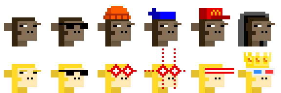
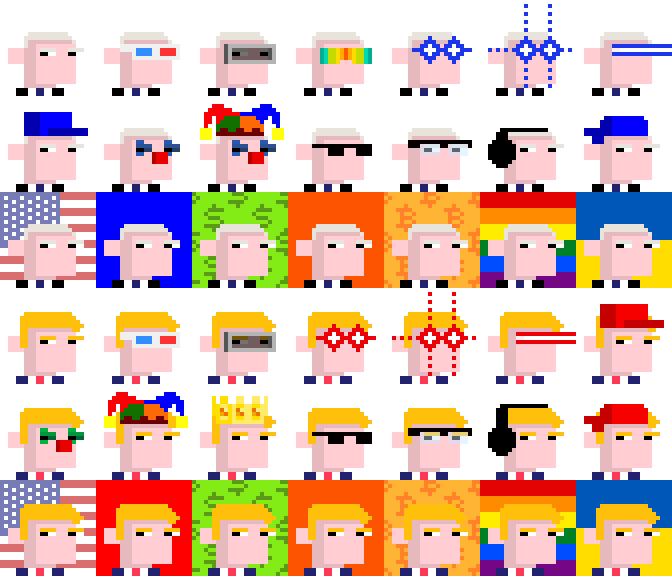
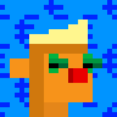
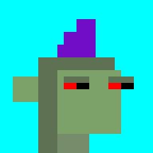
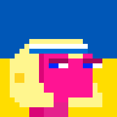

Looking for 1000 Rocks (28px)? 
See [Let's Rock (28×28px) »](https://github.com/ordbase/letsrock)  <br>
Looking for 21 000 Monkes (28px)? 
See [Monke See, Monke Do (28×28px) »](https://github.com/ordbase/monkesee-monkedo)


#  We Love ~~Monkes~~ Punks (24×24px)


## V2

Let's add more archetypes and accessories!


Let's go full circle and 
let's add ~~monkes~~ apes to node punks (24×24px).  
The planet ape line-up in 4x.  Classic and Golden.  



The (meta data) specs read:

```
ape
ape, regular shades
ape, knitted cap
ape, bandana
ape, cap mcd
ape, hoodie
  
ape golden
ape golden, regular shades
ape golden, laser eyes red
ape golden, laser eyes 2 red
ape golden, laser eyes 3 red
ape golden, 3d glasses, crown
```


Let's do node punks for presidents! Let's try the joe (biden) 
and donald (trump) readymades. The line-up in 4x.  



The (meta data) specs read:

```
joe
joe, 3d glasses
joe, vr
joe, polarized shades
joe, laser eyes blue
joe, laser eyes 2 blue
joe, laser eyes 3 blue
joe, cap blue
joe, clown eyes blue, clown nose
joe, clown eyes blue, clown nose, jester hat
joe, regular shades
joe, horned rim glasses
joe, headphone
joe, do-rag blue

bg usa, joe
bg blue, joe
bg dollar pattern, joe
bg bitcoin orange, joe
bg bitcoin pattern, joe
bg rainbow, joe
bg ukraine, joe

donald
donald, 3d glasses
donald, vr
donald, laser eyes red
donald, laser eyes 2 red
donald, laser eyes 3 red
donald, cap red
donald, clown eyes, clown nose
donald, jester hat
donald, crown
donald, regular shades
donald, horned rim glasses
donald, headphone2
donald, do-rag red

bg usa, donald
bg red, donald
bg dollar pattern, donald
bg bitcoin orange, donald
bg bitcoin pattern, donald
bg rainbow, donald
bg ukraine, donald
```


Stay tuned for more.


## V1 (Anno 2023)

### What's News? Updates

**NEW!**   Mint via [Bitcoin Ordinal Inscriptions](https://ordinals.com) in December, 2023.
Find the 5000 Node Punks:

- @ Ordzaar  <https://ordzaar.com/marketplace/collections/thenodepunks>
- @ Magic Eden (ME) <https://magiceden.io/ordinals/marketplace/nodepunks>  
 


### Intro

Let's generate 5000 punks (24×24px) in a "We Love ~~Monkes~~ Punks" reference edition.


Find all 5000 reference images one-by-one in 24×24px in [**/i**](i):


 ...

and in 8x (196×196px) in [**/i@8x**](i@8x):






 ...


Find all meta data in the [welovepunks.csv](welovepunks.csv) tabular dataset e.g.

```
id, type, accessories, background
0, maxibiz, chinstrap / tophat / goldchain, bitcoin orange
1, black, bob / lasereyes2 red, bitcoin pattern
2, default, capforward / earring / polarizedshades, default
3, dark, chinstrap light / wizardhat / earring / lasereyes3 green, green
4, light, chinstrap / cowboyhat / vr, dollar pattern
5, albino, headband / lasereyes3 green, blue
6, orange, mohawk2 blonde / clowneyes / clownnose, euro pattern
7, zombie, mohawk purple, aqua
8, orc, chinstrap light / wildhair red / classicshades, classic
9, alien, bandana / eyemask, rainbow
10, pink, bob blonde / headband / earring, ukraine
...
```


Bonus - All together now. Find the composite fam image of all 5000 in a 100×50 grid in [welovepunks.png](welovepunks.png) (~550kb - 2400×1200px).


### Builders Corner - Yes, You Can

For reference find all (generative) attributes (base types, backgrounds and accessories) in 24×24px in [**/attributes**](attributes).


Yes, you can generate your own samples via "text prompts" using the generate_samples script and you can regenerate this random set 
using the generate_meta script
and using the generate script to generate all images
from the tabular dataset.


## Questions? Comments?


Join us in the [Ordbase (Incl Ordgen / ORC-721) discord (chat server)](https://discord.gg/dDhvHKjm2t). Yes you can.
Your questions and commentary welcome.

Or post them over at the [Help & Support](https://github.com/geraldb/help) page. Thanks.


