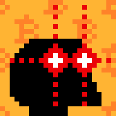
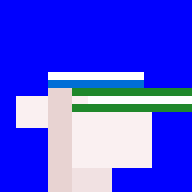

Looking for 1000 Rocks (28px)? 
See [Let's Rock (28×28px) »](https://github.com/ordbase/letsrock)  <br>
Looking for 21 000 Monkes (28px)? 
See [Monke See, Monke Do (28×28px) »](https://github.com/ordbase/monkesee-monkedo)


#  We Love Monkes (24×24px)

## What's News? Updates

**NEW!**   Mint via [Bitcoin Ordinal Inscriptions](https://ordinals.com) in December, 2023.
Find the 5000 Node Punks:

- @ Ordzaar  <https://ordzaar.com/marketplace/collections/thenodepunks>
- @ Magic Eden (ME) <https://magiceden.io/ordinals/marketplace/nodepunks>  
 


## Intro

Let's generate 5000 punks (24×24px) in a "We Love Monkes" reference edition.


Find all 5000 reference images one-by-one in 24×24px in [**/i**](i):


 ...

and in 8x (196×196px) in [**/i@8x**](i@8x):








 ...


Find all meta data in the [welovemonkes.csv](welovemonkes.csv) tabular dataset e.g.

```
id, type, accessories, background
0, maxibiz, chinstrap / tophat / goldchain, bitcoin orange
1, black, bob / lasereyes2 red, bitcoin pattern
2, default, capforward / earring / polarizedshades, default
3, dark, chinstrap light / wizardhat / earring / lasereyes3 green, green
4, light, chinstrap / cowboyhat / vr, dollar pattern
5, albino, headband / lasereyes3 green, blue
6, orange, mohawk2 blonde / clowneyes / clownnose, euro pattern
7, zombie, mohawk purple, aqua
8, orc, chinstrap light / wildhair red / classicshades, classic
9, alien, bandana / eyemask, rainbow
10, pink, bob blonde / headband / earring, ukraine
...
```


Bonus - All together now. Find the composite fam image of all 5000 in a 100×50 grid in [welovemonkes.png](welovemonkes.png) (~550kb - 2400×1200px).


## Builders Corner - Yes, You Can

For reference find all (generative) attributes (base types, backgrounds and accessories) in 24×24px in [**/attributes**](attributes).


Yes, you can generate your own samples via "text prompts" using the generate_samples script and you can regenerate this random set 
using the generate_meta script
and using the generate script to generate all images
from the tabular dataset.


## Questions? Comments?


Join us in the [Ordbase (Incl Ordgen / ORC-721) discord (chat server)](https://discord.gg/dDhvHKjm2t). Yes you can.
Your questions and commentary welcome.

Or post them over at the [Help & Support](https://github.com/geraldb/help) page. Thanks.


